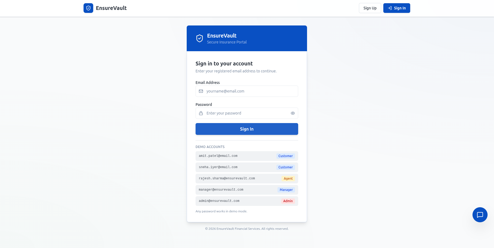
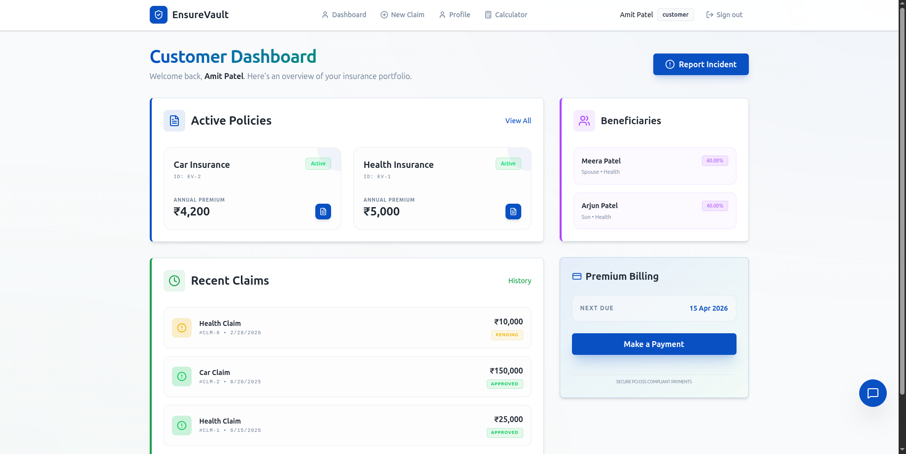
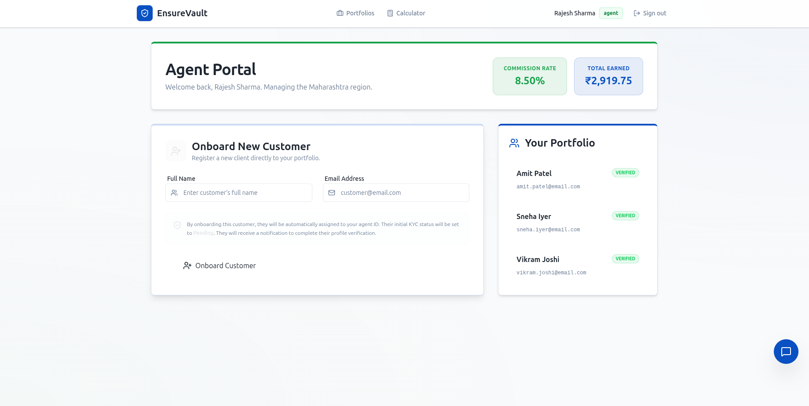
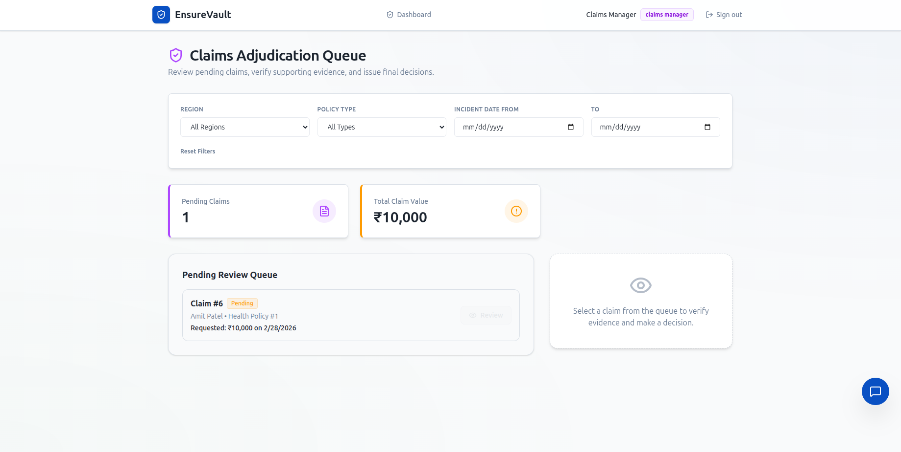
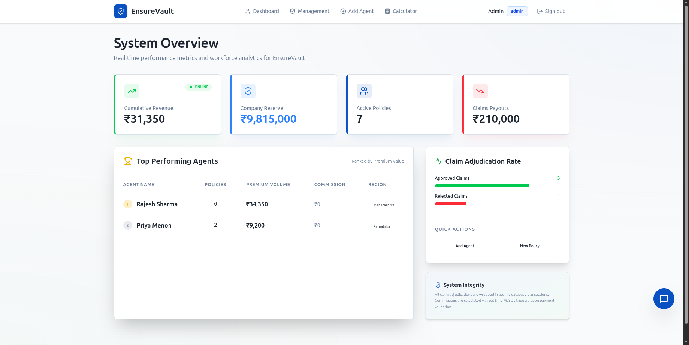

# EnsureVault - Insurance and claims Proccessing System

<p align="center">
  
</p>

**EnsureVault** is a comprehensive, secure, and professional insurance policy and claims management platform built with modern web technologies. Designed with a banking-grade user interface and robust backend architecture, EnsureVault streamlines the entire insurance lifecycle—from policy issuance to claims adjudication—providing a seamless experience for administrators, agents, customers, and claims managers.

---

## Application Preview

### Customer Dashboard
<p align="center">
  
</p>

View active policies, submit claims, manage beneficiaries, and make premium payments—all in one place.

---

### Agent Dashboard
<p align="center">
  
</p>

Manage client portfolios, issue new policies, and track performance metrics.

---

### Claims Manager Dashboard
<p align="center">
  
</p>

Review pending claims, verify evidence, and make adjudication decisions with comprehensive filtering options.

---

### Admin Dashboard
<p align="center">
  
</p>

Manage system configuration, create policy types, and oversee agent operations.

---

## How EnsureVault Helps Users

### **For Customers** 
- **Easy Policy Management**: View all active insurance policies (Health, Home, Car) in one centralized dashboard
- **Instant Premium Calculator**: Get real-time premium estimates based on age, risk factors, and coverage needs
- **Simple Claims Submission**: File claims online with document upload support
- **Transparent Tracking**: Monitor claim status and approval process in real-time
- **Secure Payments**: Make premium payments through an integrated, PCI-DSS compliant payment gateway
- **Beneficiary Management**: Add and manage policy beneficiaries with share percentage allocation

### **For Insurance Agents** 
- **Client Portfolio Management**: View and manage all customers assigned to you
- **Policy Issuance**: Create new insurance policies for customers with automated premium calculation
- **Performance Tracking**: Monitor your sales and commission metrics
- **Quick Access Tools**: Use the premium calculator to provide instant quotes to prospects

### **For Claims Managers** 
- **Adjudication Queue**: Review pending claims with all supporting documentation
- **Evidence Verification**: Access uploaded documents and incident details
- **Decision Making**: Approve or reject claims with detailed reasoning
- **Advanced Filtering**: Filter claims by region, policy type, and incident date
- **Workload Visibility**: Track pending claims and total claim values at a glance

### **For Administrators** 
- **System Oversight**: Manage policy types, coverage rules, and premium structures
- **Agent Management**: Create agent accounts and assign territories
- **Analytics Dashboard**: Monitor system-wide metrics and financial data
- **Policy Type Configuration**: Define new insurance products with custom rules and pricing

---

## How It Works

### **1. User Authentication & Role-Based Access**
EnsureVault implements strict Role-Based Access Control (RBAC):
- **Customers** access their personal portfolio and claims
- **Agents** manage their client base and issue policies
- **Claims Managers** adjudicate submitted claims
- **Admins** control system-wide configuration

Each role has a tailored dashboard with only the relevant features, ensuring security and usability.

### **2. Policy Lifecycle Management**
```
Admin creates policy type → Agent issues policy to customer → 
Customer pays premiums → Policy becomes active → Coverage begins
```

### **3. Claims Processing Workflow**
```
Customer files claim → Uploads supporting documents → 
Claims Manager reviews evidence → Decision (Approve/Reject) → 
If approved: Payout processed automatically
```

### **4. Premium Calculation Engine**
The system uses sophisticated algorithms to calculate premiums based on:
- **Customer Age**: Younger customers get better rates
- **Risk Factors**: Health conditions, vehicle type, property location
- **Coverage Amount**: Higher coverage = higher premiums
- **Policy Type**: Health, Home, or Car insurance have different pricing models

### **5. Secure Payment Processing**
- Integrated payment gateway with SSL encryption
- Support for Credit/Debit cards (Visa, Mastercard, RuPay)
- PCI-DSS compliant payment handling
- Real-time payment confirmation

---


