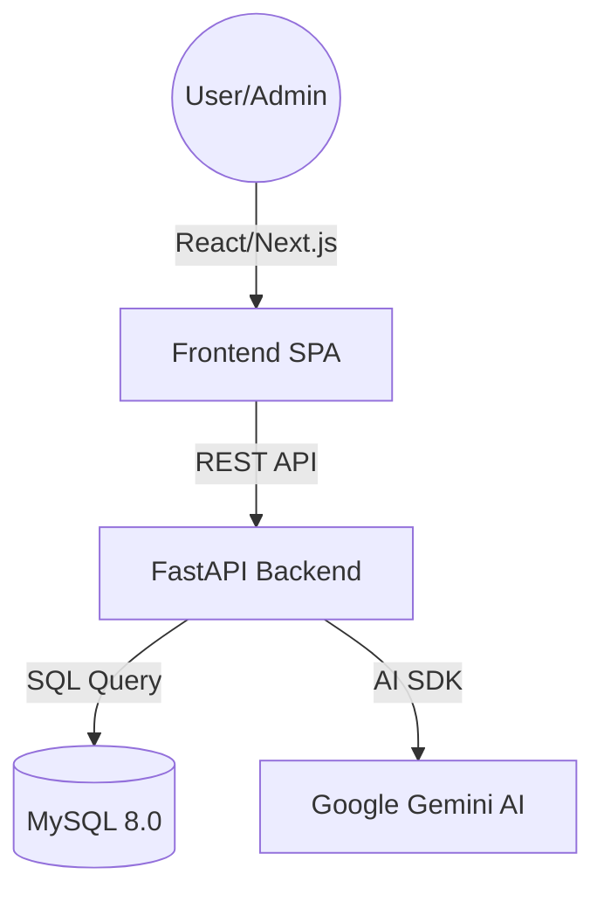

# Technical Reference — EnsureVault Architecture

This document provides a deep dive into the EnsureVault codebase, detailing the architecture, data flow, and specific implementation details for each component.

---

## 1. System Architecture
EnsureVault follows a modern, decoupled client-server architecture designed for scalability and high-performance insurance operations.

- **Backend**: Python 3.12, FastAPI, MySQL-Connector.
- **Frontend**: Next.js 14 (App Router), Tailwind CSS, Lucide icons.
- **Quality**: GitHub Actions, Ruff, Pytest, Jest.

---

## 2. Backend Deep Dive (`/backend`)

### Core Infrastructure
- **`src/main.py`**: 
    - Initializes the FastAPI app.
    - Configures CORS for the frontend domain.
    - Registers all routers under the `/api/v1` prefix.
    - Implements a `lifespan` event to manage the database connection pool properly.
- **`src/database.py`**: 
    - Implements MySQL connection pooling using `mysql.connector.pooling`.
    - `get_db()`: A generator dependency that yields a connection and ensures it returns to the pool after the request.
- **`src/config.py`**:
    - Uses Pydantic's `BaseSettings` for type-safe environment variable loading.
    - Key variables: `DATABASE_URL`, `GEMINI_API_KEY`.

### Functional Routers (`src/routers/`)
- **`ai.py`**: 
    - Implements the "AI Concierge".
    - **Lazy Initialization**: The Gemini model is initialized only on the first request to save resources.
    - **Mock Fallback**: If the `GEMINI_API_KEY` is missing or the service is down, it falls back to a deterministic insurance-specific logic to ensure the UI stays functional.
- **`payouts.py`**:
    - **Atomic Transactions**: Payouts are handled within a manual transaction (`db.autocommit = False`).
    - **Reserve Management**: Deducts funds from the `company_reserve` table only if the claim status is successfully updated to 'Approved'.
- **`risk_assessment.py`**:
    - Directly interfaces with MySQL stored procedures (e.g., `CALL assess_claim_risk`).
    - Handles complex risk factor calculations derived from customer history and policy statistics.
- **`admin.py`**:
    - Fetches metrics from optimized SQL views (`v_agent_leaderboard`).
    - Uses Pydantic models to validate large analytical datasets before sending them to the dashboard.

---

## 3. Frontend Deep Dive (`/frontend`)

### Architecture & Design System
- **App Router**: Uses Next.js 14 App Router for directory-based navigation and optimized bundling.
- **`globals.css`**: Defines the "Elite UI" design system.
    - **Glassmorphism**: Custom utilities like `.glass-card` using `backdrop-blur-md` and `bg-white/10`.
    - **Animations**: Custom keyframes for `animate-slide-up` and `animate-fade-in`.

### Key Components (`components/`)
- **`Chatbot.tsx`**: 
    - A floating, persistence-aware AI widget.
    - Uses a concierge-style floating action button (FAB) that opens into a professional Navy/Emerald chat window.
    - Synchronized with system toasts to ensure visibility.
- **`Navbar.tsx`**: 
    - Implements role-based navigation.
    - Admins see "Admin Dashboard", Customers see "My Portfolio".

### Global State (`context/AuthContext.tsx`)
- Provides a `useAuth` hook throughout the app.
- Stores the current user's session in memory/local storage to persist login status across refreshes.

---

## 4. Database Logic (`/backend/sql`)

### Business Rules (Triggers)
The database enforces complex business logic via triggers in `triggers.sql`:
- **Commission Auto-Calculation**: Automatically calculates and records agent commission whenever a policy is issued.
- **KYC Verification**: Prevents claim filing for customers with 'Pending' or 'Rejected' KYC status.
- **Expiration Guard**: Automatically marks policies as 'Expired' when the current date exceeds the `end_date`.

### Performance Views
- **`v_agent_leaderboard`**: Pre-calculates sales performance and commission rankings to keep the Admin Dashboard loading time under 100ms even with large datasets.

---

## 5. CI/CD & Reliability

### Automated Quality Gates
The project uses GitHub Actions (`.github/workflows/main.yml`) to enforce high code quality:
1. **Ruff (Backend)**: Enforces industry-standard Python linting and import sorting.
2. **Pytest (Backend)**: Runs sanity checks using a mocked database environment.
3. **Jest (Frontend)**: Verifies UI component rendering and authentication logic.
4. **Docker Build**: Every push verifies that the production images can be built successfully.

### Deployment instructions
Refer to [DEPLOYMENT.md](file:///home/dhruv/sem4/DBMS/EnsureVault/DEPLOYMENT.md) for full instructions on running the system using Docker Compose.
